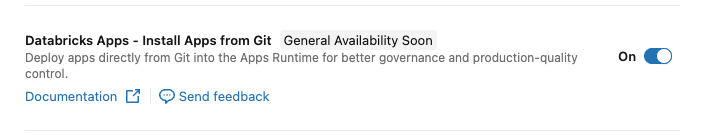
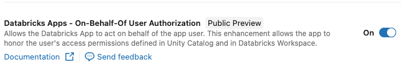

developed by Databricks MVP - Maksim Pachkouski:

[](https://medium.com/@protmaks) &nbsp;
[](https://linkedin.com/in/protmaks) &nbsp;
[](https://github.com/protmaks) &nbsp;

# Databricks App — Jobs Admin v0.1 (Streamlit)

[Article with description]([https://medium.com/@protmaks](https://medium.com/data-engineer-things/databricks-jobs-monitoring-in-your-custom-databricks-app-67c81014473f))

It splits a Streamlit project into a tiny, flat structure instead of one large `app.py`:

- **`app.py`** — entry point: page configuration and navigation only.
- **`pages/`** — one file per page; each page is a self-contained script.
- **`assets/`** — static files: logos.

Use this as a clean starting point and add your own pages.
 
---

## Project structure

```
app.py                          # st.set_page_config + st.navigation
app.yaml                        # Databricks App run command
requirements.txt
pytest.ini                      # Pytest configuration
pages/
  description.py                # Main description page
  utils.py                      # Utility functions
  jobs_and_pipelines/
    jobs_run_daily.py           # Daily jobs monitoring
  settings/
    __init__.py
    settings_page.py            # Settings page entry
    storage.py                  # Settings storage utilities
assets/
  logo.png, logo_sm.svg
  apps_enable_install_from_git.png
  apps_enable_user_auth.png
tests/                          # Test suite (84 tests)
  conftest.py                   # Pytest fixtures
  test_utils.py                 # Utils tests
  test_storage.py               # Storage tests
  test_integration.py           # Integration tests
  test_workspace_client.py      # Client tests
  test_user_prefs.py            # User prefs tests
  test_validation.py            # Validation tests
  test_performance.py           # Performance tests
  README.md                     # Testing documentation
```

Each page in `pages/` is independent — it loads its own data, renders its own widgets. Modularity here means **one page = one file**: easy to find, easy to delete, easy to copy as a starting point for a new page.

---

## Local development

1. Create a virtual environment and install dependencies:
   ```bash
   python -m venv .venv
   source .venv/bin/activate
   pip install -r requirements.txt
   ```

2. (Optional) Create a `.env` file for any secrets your app needs. `python-dotenv` is loaded by `app.py`, so anything in `.env` becomes available via `os.environ`.

3. Run the app:
   ```bash
   streamlit run app.py
   ```

---

## Testing

The project includes comprehensive test coverage with 84 tests covering all core functionality.

### Quick Start

```bash
# Run all tests
pytest

# Run with verbose output
pytest -v

# Run specific test file
pytest tests/test_utils.py
```

### Test Coverage

- **test_utils.py** (17 tests) - Team matching rules and utilities
- **test_storage.py** (13 tests) - Settings storage and persistence
- **test_integration.py** (6 tests) - End-to-end scenarios
- **test_workspace_client.py** (8 tests) - Databricks client initialization
- **test_user_prefs.py** (15 tests) - User preferences management
- **test_validation.py** (16 tests) - Configuration validation
- **test_performance.py** (9 tests) - Performance and stress tests

For detailed testing documentation, see [tests/README.md](tests/README.md).

---

## Deployment as a Databricks App

### 1. Enable Git-backed deployments

Your administrator must enable Git-backed deployments in the Databricks workspace.

1. Go to **Settings** → **Workspace Settings**.
2. Navigate to the **Previews** section.
3. Enable the toggle for **Databricks Apps Git-backed deployments**.



### 2. Install App from Git

1. In the sidebar, navigate to **Compute** and select the **Apps** tab.
2. Click the **Create app** button in the top right corner.
3. In the creation dialog, select **Git repository** as the source.
4. Fill in the repository details:
   - **Git repo URL:** Enter the full URL of your GitHub repository.
   - **Git provider:** Select **GitHub**.
5. Click **Create**.
6. Click **Deploy** with settings:
   - **Branch:** Specify the branch to deploy (e.g., `main`).
   - **App source code path:** Leave empty if the code is in the root directory.

Databricks will automatically create a Service Principal for the app and begin the build process.

### 3. Grant Permissions

If the application needs to manage workspace resources (clusters, jobs), add the App's Service Principal to the Admin group.

1. Go to **Settings** → **Identity and access** → **Groups**.
2. Select the **admins** group.
3. Click **Add members**.
4. Search for your **App Name** (or its Service Principal ID) and add it.

> **Note:** Every Databricks App creates its own identity. Granting Admin rights gives the app full control over the workspace.

To allow the app to run under the identity of the logged-in user:

1. Go to **Settings** → **Workspace Settings**.
2. Navigate to the **Previews** section.
3. Enable the toggle for **User identity for Databricks Apps**.



### 4. Set Access Permissions

1. In the sidebar, click **Compute** → **Apps**.
2. Click on the application name.
3. Go to the **Permissions** tab and configure access.

### 5. Open the App

1. In the sidebar, click **Compute** → **Apps**.
2. Click on the application name.
3. Click **Deploy** and select the **main** branch.
4. Click **Open app** in the top right corner.

### 6. Daily Usage Note

> **Important:** Stop the application when not in use, or set up a scheduled job to stop it — otherwise it runs 24/7 and continuously consumes compute resources.

To stop: go to the **Apps** tab → select your app → click **Stop**.
